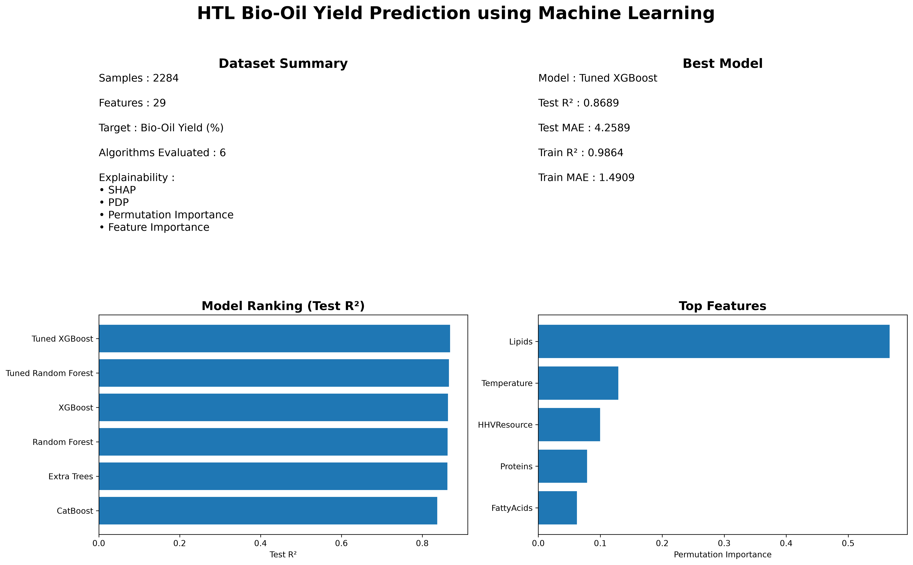

# HTL Bio-Oil Yield Prediction using Machine Learning

<p align="center">

</p>

<p align="center">


</p>

---

## Project Overview

This project develops a modular machine learning framework for predicting bio-oil yield from Hydrothermal Liquefaction (HTL) experiments.

Unlike notebook-based implementations, the project provides a reusable software architecture for preprocessing, training, hyperparameter optimization, explainability, and visualization.

---

## Key Features

- Modular ML framework
- Six regression algorithms
- Hyperparameter optimization
- SHAP explainability
- Partial Dependence Plots
- Permutation Importance
- Model comparison dashboard
- Automated experiment logging
- Publication-quality visualizations

---

## Dataset

| Property | Value |
|-----------|-------|
| Samples | 2284 |
| Features | 29 |
| Task | Regression |
| Target | Bio-Oil Yield (%) |

---

## Workflow

```
Dataset
      │
      ▼
Preprocessing
      │
      ▼
Model Training
      │
      ▼
Hyperparameter Optimization
      │
      ▼
Explainability
      │
      ▼
Dashboard
```

---

## Results

| Model | Test R² | Test MAE |
|--------|---------|----------|
| 🥇 Tuned XGBoost | **0.8689** | **4.2589** |
| Tuned Random Forest | 0.8659 | 4.2796 |
| XGBoost | 0.8634 | 4.4094 |
| Random Forest | 0.8624 | 4.4111 |
| Extra Trees | 0.8619 | **4.1621** |
| CatBoost | 0.8370 | 5.1441 |

---

## Explainability

Top predictive features:

- Lipids
- Temperature
- Higher Heating Value
- Proteins
- Fatty Acids

---

## Repository Structure

```text
src/
 ├── core/
 ├── models/
 ├── experiments/
 ├── visualization/
 └── legacy/
```

---

## Installation

```bash
pip install -r requirements.txt
```

---

## Run

```bash
python -m src.models.xgboost
```

```bash
python -m src.visualization.model_dashboard
```

---

## Future Work

- Bayesian Optimization
- LightGBM
- Deep Learning
- Streamlit Deployment
- Multi-output HTL prediction

---

## Author

**Rohan**

Indian Institute of Technology Kharagpur